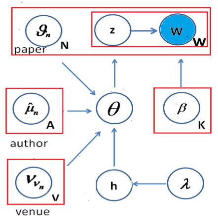
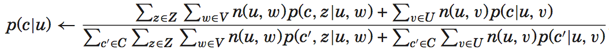

####[KDD-11] Probabilistic Topic Models with Biased Propagation on Heterogeneous Information Networks

$$G={ D\cup U\cup V,E} $$

The baseline algorithm of topic model is Probabilistic Latent Semantic Analysis(PLSA). 

####[KDD-13] The Contextual Focused Topic Model

cFTM is a nonparametric Bayesian contextual focused topic model. 

Word assignment is with two forms of context, author names ({\hat{\mu}}_n) and publication venues(\nu_{v_n}), and "random effects"(\vartheta_n). 

Clustering authors and venues is perfomed nonparametrically through use of the Dirichlet process(DP). 

The hierarchical beta process(HBP), coupled with a bernoulli process, is employed to infer the focused set of topics associated with each author and venue. 

MCMC inference is used to sample lattent variables from their conditional posterior distributions. 

#### 2012-Latent Community Topic Analysis: Integration of Community Discovery with Topic Modeling

> We handle topic modeling and community discovery in the same framework. In our model we separate the concepts of community and topic, so one community can correspond to multiple topics and multiple communities can share the same topic.

+ word-topic: p(w|z)
+ topic-community: p(z|c)
+ community-user: p(c|u)
+ (topic-user: p(z|u))

This paper uses Expectation Maximization (EM) to estimate parameters. 

