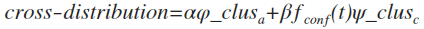

	Heterogeneous Graph = Authors + Conferences + Papers （1）

以conferencs为主要划分社区得指标，将papers弱化为authors社交网络中的节点属性(总共发表文章数)与节点之间的权重(co-authorship), 以及将papers与words的关系转化为authors与words的关系。在异构网络中引入keywords(关键／重要的词)，将异构网络（1）转化为异构网络（2）。

	Heterogeneous Graph = Authors + Conferences ＋ Keywords + Heterogeneous[Authors-Keywords] + Heterogeneous[Authors-Conferences] + Heterogeneous[Conferences-Keywords] （2）

我们的目标是将上述的三维异构网络（2）降解为Authors与Keywords的二维异构网络（3），其中的Authors-Keywords' cross-distribution将加乘conferencs对异构网络的影响。

	Heterogeneous Graph = Authors + Keywords + Authors-Keywords' cross-distribution graph （3）
	
** 暂时先不考虑学习过程 **

** 所有涉及的graph均为undirected **

1. 用Rankclus[EDBT2009, Yinzhou Sun]将conferences聚类, conf_clus
2. 用cFTM[KDD12]将keywords聚类, keywords_clus(topics)
2. 得到authors与keywords分布, \varphi_a; 进而更新为authors与keywords_clus分布, \varphi_clus_a
3. Consider conferences as *activities*, based on Conference Influence Graph (influence from conferences to authors->influence from conf_clus to authors), we can get conference influence distrubution at time t as \f_conf(t)

	
	
4. 得到conferences与keywords的分布, \psi_c; 进而更新为conf_clus与keywords_clus分布, \psi_clus_c
5. 最终authors与keywords_clus的分布为
		
		$$cross-distribution = \alpha { \varphi \_ clus }_a+\beta {f}_{conf}\left(t\right) { \psi \_ clus }_{ c }$$ （4）
		
	
	
	由此可以得到Authors-Keywords_clus的cross-distribution
	
		Heterogeneous Graph = Authors + Keywords_clus + Authors-Keywords_clus' cross-distribution graph （5）

	
最终异构网络的社区发现的问题转化为Authors与Keywords_clus构成的weighted bipartite graph的community detection
	
* 使用带memory的Label Propagation Algorithm, 目的是可以发现重叠社区
* 最终发现的社区是authors与topics(labels)的集合, 一个社区中可以有多个topics, 多个社区中也可以有同一个topic, 符合预期
* 社区划分结果可直接显示社区的属性，得到的是带有labels的社区，比较以往增加了语义信息，更直观
	
	