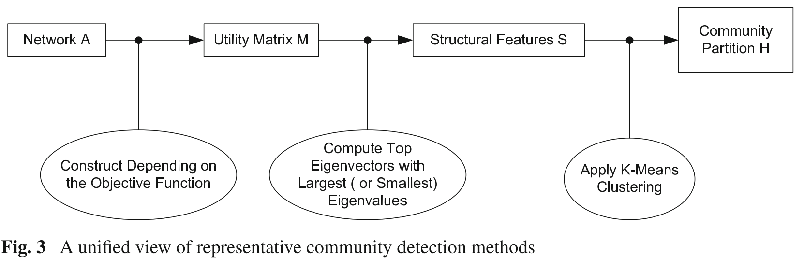

＃Community Detection on Heterogeneous Networks

####[2011-Lei Tang, Community detection via heterogeneous interaction analysis]

1. community detection in 1-D netwroks

	+ Latent space models
	+ block model approximation
	+ spectral clustering
	+ modularity maximization

	a unified view

	

2. community detection in M-D netwroks